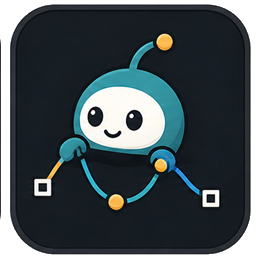

# Aminate

## Docking layout

Main Aminate panel supports Maya docking plus normal floating use. Aminate Timeline Toolkit Bar stays fixed at Maya bottom, cannot float or move, scrolls on narrow layouts. This split prevents shared dock lifecycle crashes. Docked Aminate uses Maya UI-element mode, so Maya's unsafe native close control stays unavailable in Maya 2026.

By Amir Mansaray

A tabbed Maya toolset for animation workflow helpers.

## Docs And Wiki

- [Release-root tutorial and FAQ](tutorial.html) is the simplest offline starting point in the separate tutorial asset.
- [Searchable local docs](docs/index.html) cover all 23 tabs with child-friendly steps, screenshots, GIFs, videos, expected results, troubleshooting, and button help.
- [Tracked feature wiki](docs/wiki/README.md) is the canonical full feature map for the private repo, public repo, and release package.
- [Release process](AMINATE_RELEASE_PROCESS.md) is the required checklist for drag-and-drop update packages.
- Public project: [AmirMDEV/aminate](https://github.com/AmirMDEV/aminate).

## Sections In Use

The sections in regular use in this release are:

- `Toolkit Bar` for the fixed non-movable bar at Maya's bottom edge, including History Timeline blocks, Animation Layer controls, timing buttons, Tween Machine, workflow icons, package zip, and Game Animation Mode. Narrow Maya windows use horizontal scrolling instead of shrinking controls.
- `Scene Helpers` for Animation Layer Tint, camera presets, render setup, texture loading, game animation mode, hotkey Floating Channel Box, hotkey Floating Graph Editor, text notes, and teacher demo tools
- `Reference Manager` for saving the current scene and packaging Maya references, textures, image planes, audio, caches, and a manifest into one zip
- `Controls Retargeter (Face and Body)` for control-based retarget between rigs
- `Control Picker` for automatic hierarchy-aware rig scanning, nested body-part selection sets, separate FK/IK limb groups, multi-group selection, editable custom sets, attr lookup, synced Maya selection, and live Front/Side maps built from real control positions
- `Animators Pencil` for Blue Pencil-style drawing, Photoshop-style shape tools, Camera Notes view keying, layers, frame markers, ghosting, retiming, and scene-native annotation marks
- `Animation Styling` for Spider-Verse-style held keys, configurable hold length, and timeline warnings when a future hold key would overlap an existing key
- `History Timeline` for ZBrush-style scene snapshots, restore points, milestone notes, branch tracking, and custom auto-save rules
- `Rotation Doctor` for rotation flip diagnosis, broad Euler cleanup, and one-key Blender-style Euler flipping from the Graph Editor or current keyed frame
- `Onion Skin` in `3D Ghost` mode
- `Dynamic Parenting`
- `Hand / Foot Hold`, mainly the foot-hold workflow
- `Timeline Notes`

All 23 main tabs now have a plain-language, three-step coach inside Maya and a matching deep-linked lesson in the offline tutorial. The remaining tabs are `Surface Contact`, `Dynamic Pivot`, `Universal IK/FK`, `Animation Styling`, `Character Skinning`, `Rig Scale`, `Video Reference`, `Smear Frames`, and `Customization`.

`Version 0.3.7`

## What Is New In 0.3.7

- Animator's Pencil single clicks now create a small dot at the cursor instead of an arbitrary line. Held drags keep the realtime drawing path.
- Attaching a reference video switches the active main Maya viewport to the video's Pencil View camera while keeping the Reference Viewer independent. Return to the previous camera at any time without hiding the viewer.
- The Maya drag-and-drop package is self-contained. The offline tutorial is shipped as a separate `Aminate_v0.3.7_offline_tutorial.zip` release asset.
- These new Pencil and reference-video workflows are in beta testing. The `0.3.7` release itself is not beta-labelled.

## What Is New In 0.3.6

- Release packaging now has stronger static audit coverage, including runtime package parity, installed Maya runtime checks, release ZIP payload hash checks, stale-evidence detection, and report indexing for Maya-family verification evidence.
- Smear Frames were re-tested against the installed Aminate runtime on Amanda, not only repo modules. The edit handoff now proves selected target vertices can be moved in Maya, active morph/VAT targets isolate correctly, and installed package hashes match the release payload.
- Aminate opens in a stable floating Maya window and reuses that same window after close or shelf relaunch. Maya 2026.2 workspace docking requests fall back to the floating window after native dock creation reproduced a `Qt6Core.dll` crash. The old global `S` key filter remains opt-in.
- Scene Helpers can key selected controls on every frame already keyed by any selected control. Translation and Rotation stay selected by default; scale, visibility, and custom keyable channels stay opt-in.
- The package release process now tracks `Aminate_v0.3.6.zip` from the manifest tag so future releases do not keep stale ZIP names.
- The drag-and-drop installer now includes a versioned file name, `Aminate_v0_3_6_drag_this_file_into_Maya.py`, so Maya does not reuse an older cached installer in the same Maya session.
- The release process now blocks shipping unless the package keeps both manifest files, both installer files, and the versioned drag-and-drop update path.

## What Was New In 0.3.4

- `Timeline Notes` now draw colored note ranges directly over Maya's time slider, with customizable range-bar height.
- Timeline note hovers now use a translucent Aminate bubble that fades in and shows the full formatted note, title, and frame range.
- Added a `Customize` tab to Timeline Notes for overlay visibility, hover opacity, range bar size, and default new-note color.

## What Was New In 0.3.3

- `Scene Text Notes` now create a selectable viewport resize box. Scale the box in Maya to change wrapping width and height without typing exact values.
- `Controls Retargeter (Face and Body)` now copies source channel values directly by default, keeps target offset as an explicit option, and auto-maps left-to-left, right-to-right, and center-to-center before mirrored fallback matching.
- `Character Skinning` exact-copy wording now explains one-source-to-many-targets and many-source-to-many-targets workflows more clearly.
- `Control Picker` now groups hand and finger controls under Body as left/right hand-finger subgroups so body selections include the expected sub-controls.
- `History Timeline` suppresses trusted-rig Maya Safe Mode / Trust Center prompts before snapshot save and restore operations.
- Added Amanda/Magpie preflight and feature-contract smoke checks used for heavier rig validation.

## What Was New In 0.3.2

- `Tween Machine` opens beside the cursor as a compact dark Aminate popup, shows the live percentage while dragging, uses a single-key Backquote default hotkey, can be resized for smaller screens, and toggles on/off instead of stacking duplicate windows.
- Local `Open Tutorials` documentation is included with the Maya install, with searchable tool sections, a button index, and GIF demos for Tween Machine, Character Skinning frozen-transform cleanup, and Scene Helpers feedback text.
- The Toolkit Bar, Tween Machine, and key timing paths now have focused performance checks for heavy rigs and low-impact Maya runtime smoke tests.

- `Character Skinning` keeps skinning tools together. One button replaces a badly transformed skinned mesh with a clean frozen-transform mesh while preserving skin weights and influences, and the same tab can copy exact skinning from a skinned source mesh to a same-topology target mesh.
- `Controls Retargeter (Face and Body)` is now a simple pair-row workflow: source control on the left, target control on the right, pick controls from selection, auto-map by name quickly, and reduce baked keys back to the exact source keyframes.
- `Rotation Doctor` adds `Flip Current Key`, and the Floating Graph Editor adds `Euler Flip`, for a Blender-style Euler fix that rewrites the selected Graph Editor rotation key, or current-frame selected-control key, to the nearest safe equivalent rotation.
- `Animation Assistant` adds an early pose-balance view with floor plane, contact points, center-of-gravity setup, viewport badge, and support-area drawing. This weight / pose balance check is unfinished and should be treated as preview.
- `Floating Graph Editor` is now dockable, can include a DAG-only Outliner, has cycle infinity controls, and opens or closes from hotkeys more reliably.
- `Floating Channel Box` opens near the cursor, edits selected object channels more reliably, supports opacity customization, and avoids staying above every Windows app.
- `Animation Styling` adds Spider-Verse-style held keys, blocked-hold timeline warnings, and optional stepped curves.
- `Toolkit Bar` adds Tween Machine, tab navigation buttons, synced embedded toolbar, stronger Game Animation Mode visuals, one-click 1080p full-scale AVI Playblast to Documents, and updated release packaging.
- `Scene Text Notes` now support larger default size, live sizing, auto wrap boxes, keyable visibility, pointer splines, and cleaner scene grouping.
- `Teacher Demo` rig duplication preserves more rig, material, visibility, and skinCluster data, adds clean delete, and stores student-readable edit logs in the Maya scene.
- `History Timeline` has stronger branching, snapshot filtering, storage caps, restore safety, per-scene history switching, performance guards, and clearer snapshot labels.
- `Aminate Mobu` adds MotionBuilder cleanup, skeleton mapping, characterization, History Timeline, packaging, and themed UI work.
- `Scene Helpers` is now usable for render setup, scene text notes, teacher-demo rig duplication, texture refresh, camera presets, and Game Animation Mode.
- `Controls Retargeter (Face and Body)` now works for retargeting animation between controls, between skeletons, from skeletons to controls, and between different rig layouts.
- `Toolkit Bar` now has the titleless compact bar, custom icons, Game Animation Mode, one-click package zip, animation-layer controls, and a small History Timeline strip.
- `History Timeline` adds scene snapshot saves, restore points, branch tracking, milestones, per-scene history folders, custom auto-save triggers, and an Auto History toggle for performance.
- `Control Picker` can scan almost any character or animal rig, group controls by hierarchy, body area and side, separate FK and IK below limbs and tails, combine several groups, save custom selection sets, sync selection with Maya, and place visual buttons from the rig's real Front or Side positions.
- `Animators Pencil` adds scene-backed drawing marks, shape tools, marquee selection, camera notes, layers, frame markers, ghosting, and retiming helpers.
- `Animation Styling` adds Spider-Verse-style key holds so a key can automatically copy its value forward by a configurable number of frames.
- `Reference Manager` can package the current scene and external files into a zip with clearer missing-file labels and safer copy-only packaging.
- `Scene Text Notes` let teachers place visible notes in the viewport, resize them, color them, key visibility, and attach live pointer splines to animated controls.
- `Teacher Demo` duplicates a selected rig for side-by-side animation feedback while preserving animation, visibility, colors, materials, skinning, and cleanup controls. It also lists teacher edits in plain-English bullet points, for example control rotations or custom attribute changes, and undone edits disappear from the list.

## Install

1. Download `Aminate_v0.3.7.zip` from the latest release.
2. Unzip it.
3. Open the `aminate` folder inside the extracted folder.
4. Open Autodesk Maya.
5. Drag `Aminate_v0_3_7_drag_this_file_into_Maya.py` into the Maya viewport.
6. In a fresh Maya session, Aminate opens after installation.
7. If Aminate is already open, the installer preserves that session. Restart Maya before reopening Aminate so it loads the update.
8. Optionally download `Aminate_v0.3.7_offline_tutorial.zip` from the same release, extract it, and double-click `tutorial.html` for the full offline step-by-step guide and FAQ.

## How To Use

### Toolkit Bar

This section is for the small repeat jobs students do while blocking and polishing animation.

Simple example:

1. Select one or more animated controls.
2. Use `-1` or `+1` to nudge the selected keys earlier or later.
3. Use `In` to add an inbetween key on the current frame.
4. Use `Cut` to remove a key on the current frame.
5. Use `Zero` to reset selected controls to translate 0, rotate 0, and scale 1.
6. Use `2s` to bake selected controls every two frames across the playback range.
7. Use `Open Toolkit Bar` if the fixed color-coded strip at Maya's bottom edge is hidden. The bar cannot float or move; narrow layouts scroll horizontally.

### Scene Helpers

This section is for shot setup, timing cleanup, texture refresh, scene text notes, and the always-visible timeline helper strip.

Scene Text Notes let you place feedback directly in the Maya scene. Select a control or body part, type a note, pick a color, and click `Create Text Note`. You can key the note on or off, move it beside another selected control, recolor it, refresh the list, or delete it from the UI.

Floating Channel Box lets you tap `#` by default to open a small semi-transparent channel editor beside the cursor. It lists keyable and channel-box attributes for the current selection, edits matching attributes on all selected objects, and has customizable opacity and hotkeys.

Floating Graph Editor opens a semi-transparent native Maya Graph Editor clone. It uses Maya's real Graph Editor panel, can toggle on and off with a customizable hotkey, and has customizable opacity.

Animation Layers adds four non-destructive review actions. `Duplicate Current Layer` copies every attribute and curve from the selected layer. `Consolidate Other Layers` evaluates every non-current user layer only at the union of its original keyframe times, writes one new muted layer, and preserves the originals. `Solo Current Layer` isolates the selected layer, and `Clear All Layer Solos` restores the full stack.

Game Animation Mode has its own Scene Helpers area. You can choose which setup actions run: 30 fps, realtime playback, Time Slider update view All, autosave backups, active viewports, texture reload, and weighted tangent conversion for existing animated curves.

Simple example:

1. Keep `Animation Layer Tint` on.
2. Select or change an animation layer in Maya.
3. The docked Toolkit Bar shows that layer name and tint color above the timeline.
4. Click the colored layer bar to change the current animation layer, rename it, or pick its color.
5. Use the Scene Helpers Animation Layers buttons when you need a safe copy, consolidated comparison layer, or solo review.
6. Use the blue game button at the far right of the Toolkit Bar for your checked game setup defaults.
7. Use `Set Up Render Environment` for the helper cameras, light, and cyclorama.

Across Aminate's default baking workflows, source keyframe times are preserved exactly, including fractional frames. Dense whole-frame sampling is reserved for explicit tools such as `2s` Bake On Twos and the optional FBX resampling checkbox.

### Animation Styling

Use this tab for Spider-Verse-style held keys. Set `Hold Length` to `2`, turn on `Auto duplicate new keys`, and Aminate copies a newly keyed value forward by that many frames. If another key already sits between the source key and target hold frame, Aminate skips the duplicate and marks that timeline range red so you can see the overlap.

### Dynamic Parenting

This section is for props that need to move between parents, like a magazine moving between a hand, a gun, and world space.

Simple example:

1. Put the magazine where you want it.
2. Click `Add Object`.
3. Pick the hand or gun.
4. Click `Pick Parent`.
5. If you want the object to line up to that parent, click `Snap To Parent`.
6. If you want to save a custom grip position for that parent, move the object and click `Save This Offset`.
7. Click `Switch to this Parent`.
8. Use `World` when you want the object to let go.

### Reference Manager

This section is for moving a shot to another computer without hunting for referenced files by hand.

Simple example:

1. Save the current scene once.
2. Open `Reference Manager`.
3. Click `Refresh Needed Files`.
4. Keep `Include Maya references` on.
5. Keep `Include textures, audio, caches` on.
6. Click `Package Scene To Zip`.
7. Use the created zip on another machine.

### Hand / Foot Hold

This section is for planted contact, especially when a foot should stay in place while the body keeps moving.

Simple example:

1. Pick the foot control.
2. Set the frame where the foot first touches down.
3. Set the frame where the foot stops sticking.
4. Choose the world axis you want to lock.
5. Save the hold.
6. Use the saved hold list to turn rows on, off, update them, or delete them later.

### Onion Skin

The dependable mode in the current release is `3D Ghost`.

Simple example:

1. Pick the rig root or object you want to preview.
2. Open the `Onion Skin` tab.
3. Choose your past and future ghost counts.
4. Keep the mode on `3D Ghost`.
5. Attach the preview.
6. Scrub the timeline to see the ghosted poses.

### Animators Pencil

This section is for drawing animation notes, arcs, contact marks, timing plans, simple 2D annotations, and camera-specific review notes inside Maya.

Simple example:

1. Open `Animators Pencil`.
2. Use the pinned two-row `Active Drawing` strip above the layer list. Pick a tool and colour, then click `Start Drawing` once. From a normal viewport, Aminate copies that angle into a fixed `Pencil View` camera and creates its camera-specific layer.
3. Draw in the viewport. Pencil, Brush, Line, Arrow, Rectangle, and Ellipse show a live preview while you drag. Tool, colour, size, percentage opacity, text, and layer changes update the next stroke without rebuilding the drawing context.
4. Press `E` or select `Eraser`. Choose `Partial Stroke` to cut touched sections or `Whole Stroke` to remove every touched stroke. Locked layers stay protected.
5. Choose every Pencil and shape tool from the one labelled tool list inside `Active Drawing`. The viewport marking-menu shortcut shown beside the size keys offers the same fast tool access plus `RGB Colour + Swatches...`.
6. Use the brush-size keys shown beside `Size`. Aminate chooses only unassigned Maya and Qt shortcuts.
7. Use the visible radius cursor to judge Brush and Eraser size before drawing.
8. Double-click a layer name or click `Rename` to rename it.
9. Choose Line, Arrow, Rectangle, or Ellipse in the main tool list. Use `Shape Library` for Circle, Square, Triangle, Cross, Star, and saved presets. Rectangles follow the viewport box you drag instead of inheriting camera skew.
10. Click `RGB + Swatches` in the pinned strip or marking menu. RGB changes update the next stroke immediately; `Save Current Swatch` stores scene-persistent colours.
11. New marks use `Current frame only` by default. Turn it off when a drawing should hold on later frames.
12. Move back to `persp` or another normal camera, choose a new angle, and start drawing again. Aminate saves a second fixed Pencil View and a separate layer. Use `Saved Drawing Views` to switch back at any time.
13. Enable `Live Onion Skin` for previous and next drawings while scrubbing.
14. `Stamp Current Tool`, `Shape Library`, text, marquee selection, and `Camera Notes` stay visible inside `Active Drawing`; there is no hidden Advanced Tools section.
15. Use `Add Key`, `Duplicate Previous Key`, `Retime`, `Add Frame Marker`, or `Build Ghosts` for drawing animation timing.
16. The script-managed marks are real Maya scene nodes, so the scene still shows them even without this script installed.

Camera Notes example:

1. Move the viewport to the angle where you want to draw.
2. Draw a pencil mark or shape with `Key camera when drawing` on.
3. Aminate creates or updates the Camera Notes camera on that frame.
4. Move to another frame and draw from another angle.
5. The Camera Notes camera keys to that new view, so students can scrub through notes from the same angles used when the marks were made.

### History Timeline

This section is for saving bigger restore points than Maya undo can safely handle.

Simple example:

1. Save the Maya scene once.
2. Open `History Timeline`.
3. Click `Save Step` before trying a risky change.
4. Click `Save Milestone` for important poses such as `good blocking` or `before polish`.
5. Pick a row and click `Restore` to return the whole scene to that snapshot.
6. Use the small history blocks above the animation-layer bar on the Toolkit Bar for quick save and restore while animating.
7. Restoring a snapshot jumps to that saved scene state without creating a new snapshot or moving the history order.
8. If you restore an older snapshot and keep working, Aminate creates a new colored branch instead of overwriting later saves.
9. The Toolkit Bar history squares keep showing all snapshots, so future work stays visible when you jump back.
10. Use the Branch menu and `Switch Branch` to jump between different save branches, or `Rename Branch` to give a branch a clearer name.
11. Check `History size` to see how much disk space the saved scene snapshots use together.
12. Use `History Timeline Settings` to change the backup cap. New scene histories default to `90` full Maya files; `0` means no cap.
13. Use `Delete All Snapshots` if you want to clear the scene history folder and remove all small snapshot squares.
14. Turning on Game Animation Mode asks whether to enable Auto History. Choosing Yes watches for Maya action changes and saves settled sidecar snapshots when the scene has already been saved; choosing No leaves Auto History off.
15. Use `Auto History Save Rules` to keep full save mode on, or turn it off and tick only the custom triggers you want, such as keyframes, constraints, nodes, animation layers, parenting, references, transforms, or materials.
16. Notes, colors, branch ids, auto-save rules, and changed-node metadata are stored in the sidecar history folder beside the scene.

### Timeline Notes

This section is for colored timeline ranges with readable notes attached to them.
Use the `Toolkit Bar` tab or the docked Toolkit Bar when you need key nudging, inbetweens, reset pose, bake-on-twos, Game Animation Mode, or Animation Layer Tint next to timeline review.

Simple example:

1. Highlight a range in the time slider.
2. Open `Timeline Notes`.
3. Leave the auto highlighted-range option on if you want the note to follow the selected range.
4. Type the full note text.
5. Pick a color.
6. Add the note.
7. Scrub through the timeline to read the notes in the live reader.

## Tutorial Media

- [Quick Start](release_screenshots/quick_start.png)
- [Toolkit Bar](release_screenshots/student_core.png)
- [Toolkit Bar](release_screenshots/student_timeline_bar.png)
- [Tween Machine GIF](docs/assets/tween_machine.gif)
- [Reference Manager](release_screenshots/reference_manager.png)
- [Auto Package In Zip Video](docs/assets/auto_package_zip.mp4)
- [Auto Package In Zip GIF](docs/assets/auto_package_zip.gif)
- [Dynamic Parenting](release_screenshots/dynamic_parenting.png)
- [Dynamic Parent Video](docs/assets/dynamic_parenting.mp4)
- [Dynamic Parent GIF](docs/assets/dynamic_parenting.gif)
- [Hand / Foot Hold](release_screenshots/hand_foot_hold.png)
- [Foot Hold Video](docs/assets/foot_hold.mp4)
- [Foot Hold GIF](docs/assets/foot_hold.gif)
- [Scene Helpers](release_screenshots/scene_helpers.png)
- [Scene Helpers Feedback Text GIF](docs/assets/scene_feedback_text.gif)
- [Render Environment Video](docs/assets/render_environment.mp4)
- [Render Environment GIF](docs/assets/render_environment.gif)
- [Game Animation Mode Video](docs/assets/game_animation_mode.mp4)
- [Game Animation Mode GIF](docs/assets/game_animation_mode.gif)
- [Dynamic Pivot](release_screenshots/dynamic_pivot.png)
- [Universal IK/FK](release_screenshots/universal_ikfk.png)
- [Controls Retargeter](release_screenshots/face_retarget.png)
- [Control Picker](release_screenshots/control_picker.png)
- [Auto Selection Sets Video](docs/assets/auto_selection_sets.mp4)
- [Auto Selection Sets GIF](docs/assets/auto_selection_sets.gif)
- [Animators Pencil](release_screenshots/animators_pencil.png)
- [History Timeline](release_screenshots/history_timeline.png)
- [Onion Skin](release_screenshots/onion_skin.png)
- [Rotation Doctor](release_screenshots/rotation_doctor.png)
- [Character Skinning](release_screenshots/skinning_cleanup.png)
- [Character Skinning Frozen Transform GIF](docs/assets/character_skinning_rig_scale_fix.gif)
- [Rig Scale](release_screenshots/rig_scale.png)
- [Video Reference](release_screenshots/video_reference.png)
- [Timeline Notes](release_screenshots/timeline_notes.png)
- [Smear Frames](docs/assets/smear_frames.png)
- [Customization](docs/assets/customization.png)

## License

Aminate is proprietary source-available software under the [Aminate Proprietary Source-Available License](LICENSE).

Plain-English summary:

- You can use unmodified Aminate for private, educational, internal, commercial, studio, client, teaching, training, and production work.
- You can redistribute unmodified copies if you keep the license, copyright notice, and credit links intact.
- You cannot modify, patch, extend, fork, rebrand, sell modified versions, or claim Aminate or any part of Aminate as your own work without written permission from Amir Mansaray.
- Public source access is for transparency, review, installation, and permitted use only. Aminate is not open source.
- Redistribution must credit Amir Mansaray and include links to [GitHub](https://github.com/AmirMDEV/aminate), [followamir.com](https://followamir.com), and the [donation page](https://www.paypal.com/donate/?hosted_button_id=2U2GXSKFJKJCA).
